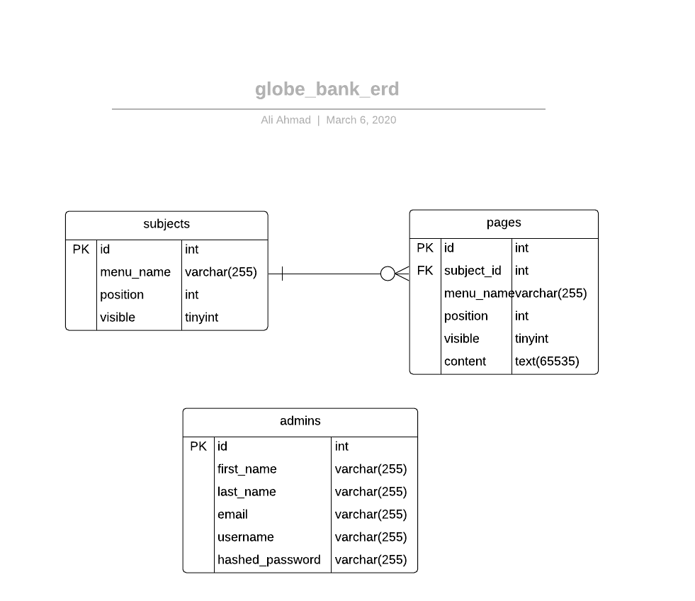

## Globe Bank

Globe bank is a content management system for managing content
related to subjects and pages.


## Setting Up Project Locally

- Download the project repository from github.
- Extract the zip file and move the project repository into server's (xampp or wamp) web root folder.
- Import the database file (globe_bank.sql) into your server.
- Start your server and type `localhost/globe_bank/public` to view the site.

## Description

This project has public as well as admin interfaces. Public interface is intended for normal user which you can access by typing `localhost/globe_bank/public` in your browser address bar.

Public interface lists all the visible subjects in the navbar and visible pages as Sub-Menus.

## Admin Access

You can access the admin interface by typing the address `localhost/globe_bank/public/staff`. It will redirect you to a login page. Login by using the below credentials.

```
User name: johndoedev
Password: Johndoe@12345
```

The admin interface is the place where you can add, edit or delete subject, pages and manage admins. You can view pages associated with a particular subject by clicking the view menu in the subjects table.

## Directory and File structure

```
│
├───.vscode
│       launch.json
│
├───private
│   │   auth_functions.php
│   │   database.php
│   │   db_credentials.php
│   │   functions.php
│   │   initialize.php
│   │   query_functions.php
│   │   validation_functions.php
│   │
│   └───shared
│           public_footer.php
│           public_header.php
│           public_navigation.php
│           staff_footer.php
│           staff_header.php
│           static_homepage.php
│
└───public
    │   index.php
    │   language.php
    │
    ├───images
    │   │   gbi_logo.png
    │   │
    │   ├───homepage_assets
    │   │       family_buying_home_L30707.jpg
    │   │
    │   └───page_assets
    │           about us_96582054.png
    │           banking_57278269.png
    │
    ├───staff
    │   │   index.php
    │   │   login.php
    │   │   logout.php
    │   │
    │   ├───admins
    │   │       delete.php
    │   │       edit.php
    │   │       index.php
    │   │       new.php
    │   │       show.php
    │   │
    │   ├───pages
    │   │       delete.php
    │   │       edit.php
    │   │       index.php
    │   │       new.php
    │   │       show.php
    │   │
    │   └───subjects
    │           delete.php
    │           edit.php
    │           index.php
    │           new.php
    │           show.php
    │
    └───stylesheets
            public.css
            staff.css
```

## Database ERD


